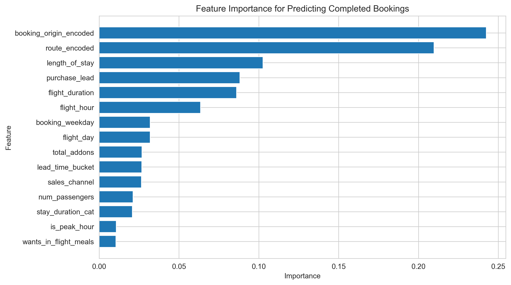

# A Customer Booking Prediction Analysis Task
## British Airways Job Simulation

## Project Background
With the rise of digital platforms, customers have access to vast amounts of information before making travel decisions. Airlines can no longer rely solely on reactive strategies, such as last-minute airport promotions, to drive ticket sales. Instead, leveraging data and predictive modeling enables airlines to proactively target potential customers before they finalize their travel plans.

This project focuses on developing a high-quality predictive model to assess customer booking behavior, helping British Airways optimize their marketing and sales strategies. The analysis includes data preparation, feature engineering, model building, and performance evaluation to determine the most influential factors in predicting customer bookings.

## Key Insights and Recommendations

### **Category 1: Customer Booking Behavior Analysis**
- Identified key features influencing booking decisions, with `booking_origin` and `route` being the most significant predictors.
- `Length_of_stay` and `purchase_lead` show strong correlations with booking completion, indicating that longer lead times and extended stays impact purchasing decisions.
- Recommendation: British Airways should use targeted promotions for travelers with long purchase leads and extended stays to increase conversion rates.

### **Category 2: Feature Importance and Model Performance**
- The model achieved **90% accuracy**, with an **ROC-AUC score of 0.9017**, indicating strong predictive performance.
- The top predictive features include `booking_origin`, `route`, `length_of_stay`, and `purchase_lead`.
- Recommendation: Utilize these key features in marketing segmentation and personalized campaign strategies.

### **Category 3: Customer Preferences and Upselling Opportunities**
- Add-on services (`wants_extra_baggage`, `wants_preferred_seat`, `wants_in_flight_meals`) have lower feature importance but can be leveraged for upselling.
- Recommendation: Implement targeted promotions for these add-ons based on customer profiles and past purchase behaviors.

### **Category 4: Data-Driven Decision Making for British Airways**
- The insights from the model could enable British Airways to proactively engage potential customers before their booking decisions.
- Recommendation: British Airways should integrate predictive analytics into their CRM systems to refine customer targeting and maximize revenue.


### Data Sources and Tools

- **Dataset**: The analysis is based on a dataset containing customer booking behavior and related features. **The raw dataset** used is [here](data/raw).
    - Information about the source of the dataset can be found [here](https://www.theforage.com/simulations/british-airways/data-science-yqoz?reloaded=true)
- **Notebook**: The notebooks containing preprocessing, EDA, and model training process for this case study can be found [here](Notebooks/).


## Data Structure & Initial Checks

The main dataset used for this project consists of customer booking behavior at British Airways, aiming to predict booking completion. The dataset includes various numerical and categorical features related to booking details, user preferences, and flight characteristics.

### Dataset Overview
**Table: British Airways Customer Booking Data**

The dataset contains behavioral metrics related to flight bookings, including:

- **num_passengers**: Number of passengers in the booking.
- **purchase_lead**: Days between booking and departure.
- **length_of_stay**: Duration of stay at the destination.
- **flight_hour**: Hour of the flight departure.
- **flight_day**: Day of the flight.
- **route**: Flight route taken.
- **booking_origin**: Origin country of the booking.
- **wants_extra_baggage**: Whether extra baggage was selected.
- **wants_preferred_seat**: Whether a preferred seat was chosen.
- **wants_in_flight_meals**: Whether in-flight meals were selected.
- **flight_duration**: Duration of the flight.
- **booking_complete (Target Variable)**: Whether the booking was completed (1) or not (0).

### Dataset Schema

| Feature                  | Data Type  | Description |
|--------------------------|-----------|-------------|
| num_passengers          | Integer   | Number of passengers in the booking. |
| purchase_lead          | Integer   | Days between booking and departure. |
| length_of_stay         | Integer   | Duration of stay at the destination. |
| flight_hour            | Integer   | Hour of the flight departure. |
| flight_day             | Categorical | Day of the flight. |
| route                 | Categorical | Flight route taken. |
| booking_origin        | Categorical | Origin country of the booking. |
| wants_extra_baggage   | Boolean    | Whether extra baggage was selected. |
| wants_preferred_seat  | Boolean    | Whether a preferred seat was chosen. |
| wants_in_flight_meals | Boolean    | Whether in-flight meals were selected. |
| flight_duration       | Float      | Duration of the flight. |
| booking_complete      | Boolean    | Target variable: 1 if booking was completed, 0 otherwise. |


### Initial Data Checks
1. **Total Rows**:
   - The dataset contains 50,000 rows of data or booking records.

2. **Missing Values**:
   - No missing values was found in the dataset.

3. **Data Types**:
   - All numerical columns were verified to be of type `float` or `int`.

4. **Duplicates**:
   - Duplicates bookings which could lead to noise were removed from the dataset.

5. **Consistency**:
   - The values in each columns were confirmed to have consistent data types.
  
7. **Class Imbalance**:
   - `booking_complete` class is imbalanced (14.99% completed vs. 85.00% not completed). Applied resampling techniques to balance the classes.
  

### Data Processing Summary
1. **Feature Engineering**: Created interaction features, aggregated booking behavior.

2. **Categorical Encoding**: Label and Target encoding was done for categorical variables with low and high cardinality respectively.

3. **Outliers**: Applied log transformation to numerical features with extreme outliers.

4. **Feature Selection using RFE**: Iteratively removes least important features.

5. **Model Selection**: Trained a Random Forest Classifier for prediction.

6. **Feature Importance**: Used tree-based methods to identify key predictors.
  
  
# Repository Structure
```
British-Airways-Booking-Dataset/
├── data/
│   ├── raw/                      # Original, unprocessed data files
│   │   └── customer_booking.csv
│   ├── processed/                # Cleaned and processed data files
│   │   └── data_cleaned.csv
│
├── notebooks/
│   └── Getting Started.ipynb    # Data cleaning and preprocessing
|
├── visualizations/
│   ├── all_visualizations.png
|   ├── categorical_distributions.png
|   ├── correlation_matrix.png
|   ├── numerical_distributions.png
|   └── purchase_lead_vs_booking_complete.png
│
├── scripts/
│   └── __init__.py                # Helper scripts and utilities
│
├── model/
│   └── booking_prediction_model.pkl # Saved machine learning model
│
├── reports/
│   ├── figures/                   # Visualizations and plots
│   │   └── feature_importance.png
│   └── executive-summary.pptx           # Final analysis report
│
├── .gitignore                     # Files and folders to ignore
├── requirements.txt                # Python dependencies
└── README.md                       # Project overview and instructions

```

# Executive Summary

### Overview of Findings
This analysis identifies key drivers of British Airways booking behavior and provides actionable insights to enhance customer acquisition and revenue optimization. The three most important findings are:
1. **Booking origin is the strongest predictor of booking completion**, indicating that regional demand plays a significant role in conversion rates.
2. **Route and length of stay significantly influence booking likelihood**, suggesting that pricing and availability strategies should be tailored accordingly.
3. **Lead time (purchase_lead) and flight duration affect booking behavior**, where shorter lead times and moderate flight durations correlate with higher booking probabilities.

The feature importance graph for booking completion prediction is shown below. Further analysis is required to refine the model’s predictive power.

- The trained prediction model is not available for downloaded because its size exceeds 100mb, Github doesn't allow file uploads beyond this limit.

A one-page PowerPoint executive summary is available for download [here](Reports/executive-summary.pptx).

# Insights Deep Dive
### Analysis of Booking Behavior by Region (Category 1):

1. **Booking Completion by Origin**:
   - Certain regions show significantly higher conversion rates than others.
   - Optimized marketing efforts targeting high-conversion regions can improve acquisition strategies.

### Analysis of Booking Behavior by Route (Category 2):

1. **Top Performing Routes**:
   - Specific flight routes demonstrate consistently higher booking completion rates.
   - Adjusting pricing and promotions on high-performing routes can maximize revenue.

### Analysis of Booking Behavior by Purchase Lead Time (Category 3):

1. **Impact of Lead Time on Booking Completion**:
   - Bookings made within shorter lead times tend to have higher conversion rates.
   - Dynamic pricing strategies can be optimized based on observed lead time trends.

### Analysis of Booking Behavior by Flight Duration (Category 4):

1. **Effect of Flight Duration on Bookings**:
   - Medium-duration flights tend to have the highest booking completion rates.
   - Long-haul flights may require additional incentives to improve conversion.

   <p align="center">
    
</p>


---

# Key Insights  
The analysis revealed several key insights:  
1. **Booking origin and route are the most influential factors** in predicting booking completions, contributing to nearly 46% of feature importance.  
2. **Flight duration and length of stay significantly impact bookings**, with shorter trips more likely to convert.  
3. **Additional service preferences (baggage, meals, preferred seats) show moderate impact**, indicating that upselling strategies could be optimized.  

# Recommendations  
Based on the insights and findings above, we recommend the British Airways's business team to consider the following:  

1. **Market-Specific Booking Strategies:**  
   - *Observation:* Booking origin is the strongest predictor, with certain regions showing significantly higher conversion rates.  
   - *Recommendation:* Tailor promotions and pricing strategies based on origin-specific demand and conversion trends.  

2. **Lead Time Optimization:**  
   - *Observation:* Shorter purchase lead times are linked to higher conversion rates.  
   - *Recommendation:* Implement dynamic pricing and targeted last-minute discounts to maximize bookings closer to departure dates.  

3. **Flight Duration & Stay Optimization:**  
   - *Observation:* Shorter flights and trips lead to higher booking rates.  
   - *Recommendation:* Optimize flight schedules and pricing for short-haul routes and weekend getaways to enhance conversions.  

4. **Upsell and Ancillary Revenue Strategy:**  
   - *Observation:* Preferences for baggage, meals, and preferred seating moderately impact bookings.  
   - *Recommendation:* Improve personalization of upsell offers and bundle services based on past booking behaviors.  

5. **Further Research on Behavioral Triggers:**  
   - *Observation:* While key factors are identified, 20% of booking behavior remains unexplained.  
   - *Recommendation:* Investigate additional behavioral data, such as loyalty program engagement and past travel history, to refine prediction models.  

By implementing these recommendations, the airline can enhance conversion rates and optimize revenue from customer bookings.  

# Assumptions and Caveats  
Throughout the analysis, multiple assumptions were made to address data limitations:  

1. **Assumption 1**: Booking completion is influenced only by available dataset features, excluding external factors like airline reputation, seasonality, or marketing campaigns.  
2. **Caveat 1**: The dataset does not include real-time pricing fluctuations, which could significantly impact customer booking behavior.  
3. **Caveat 2**: The model assumes that past booking behavior patterns remain stable over time, though demand shifts may alter predictive accuracy.  
4. **Caveat 3**: The feature importance ranking explains most, but not all, variations in booking likelihood, suggesting room for further enhancements in data collection and model refinement.  
